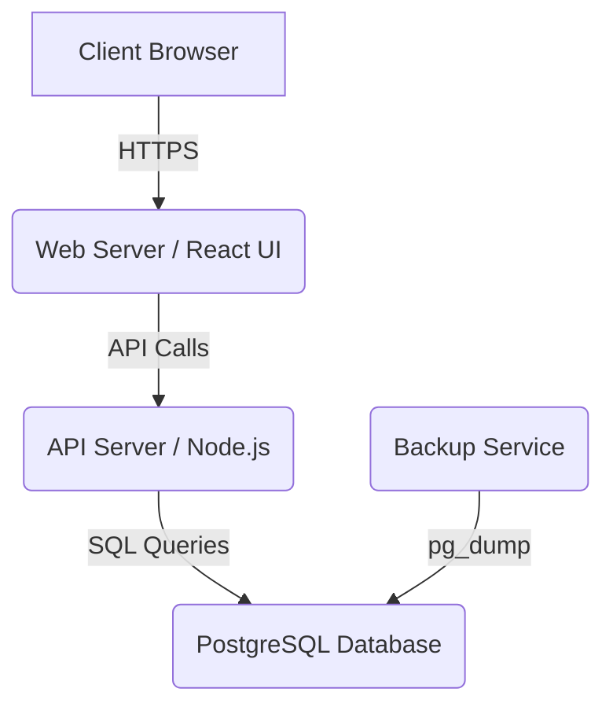

# 🏬 Forson Business Suite
An integrated ERP/Point-of-Sale solution for auto parts businesses.


**Quick Links:**
[Overview](#overview) •
[Quick Start](#-quick-start) •
[Installation](#-installation--setup) •
[Architecture](#-architecture-overview) •
[Usage](#-usage) •
[API Samples](#-sample-api-calls) •
[Troubleshooting](#-troubleshooting) •
[Deployment](#-deployment) •
[Contributing](#-contributing) •
[License](#-license)

---

## Overview
Forson Business Suite is a comprehensive, containerized business management application designed specifically for the auto parts industry. Built with a modern tech stack—**React** on the frontend, **Node.js/Express** for the API, and a **PostgreSQL** database—the entire suite is orchestrated with **Docker** for easy setup and deployment. It provides essential features like role-based access control, automated SKU generation, a full-featured Point of Sale (POS) system, and powerful reporting capabilities to streamline operations.

### Key Selling Points
- **Role-Based Authentication**: Secure access control for different user roles (e.g., Admin, Sales, Warehouse).
- **Automated SKU Generation**: Standardized product codes (`GROUP-BRAND-SEQ`) for consistent inventory management.
- **Integrated Point of Sale (POS)**: Fast, intuitive interface for processing sales and managing customer transactions.
- **Comprehensive Reporting**: Generate insights with detailed reports on sales, inventory, and profitability.

---

## ✨ Features
- **Authentication**: Secure JWT (JSON Web Token) based authentication with role management.
- **Inventory Management**: Full CRUD operations for parts, including stock adjustments and location tracking.
- **Entity Management**: Manage suppliers, customers, and vehicle applications (what parts fit what cars).
- **SKU Auto-Generation**: Automatically creates unique SKUs in the format `GROUP-BRAND-SEQUENTIAL_ID`.
- **Sales Workflow**: Full goods receipt, invoicing, and Point of Sale (POS) modules.
- **Power Search**: A unified search interface to quickly find parts, customers, or invoices.
- **Reporting & Analytics**: In-depth reporting with CSV export functionality.
- **Responsive UI**: Mobile-friendly interface built with React for access on any device.

---

## 🏗️ Architecture Overview
The application uses a classic three-tier architecture, which separates the presentation, application, and data layers. This makes the system scalable, maintainable, and secure.



- **Client**: A responsive React single-page application served via Nginx.
- **API Server**: A stateless Node.js/Express server that handles business logic and communicates with the database.
- **Database**: A PostgreSQL instance for all persistent data.
- **Backup Service**: A simple cron-based service that runs `pg_dump` to create regular database backups. For production, a managed database with point-in-time recovery is highly recommended.

---

## 🚀 Quick Start
Spin up the full stack locally with Docker.

1. Clone the repository
```powershell
git clone https://github.com/kent1l/forson-business-suite.git
cd forson-business-suite
```

2. Create a root .env (used by Docker Compose and the API)
The backend reads discrete DB_* variables, not a single DATABASE_URL.
```env
# Database
DB_HOST=db
DB_PORT=5432
DB_NAME=forson_business_suite
DB_USER=postgres
DB_PASSWORD=change_me

# Meilisearch
MEILISEARCH_MASTER_KEY=change_me_meili

# API
JWT_SECRET=change_me_jwt
```

3. Build and run (local)
```powershell
# from project root
docker compose up -d --build
```

4. Initialize the database (first time only)
```powershell
# copy schema into the db container and execute it
docker cp ./database/initial_schema.sql forson_db:/initial_schema.sql
docker exec -u postgres forson_db psql -d forson_business_suite -f /initial_schema.sql
# then apply all migrations (recommended)
# PowerShell loop:
# Get-ChildItem .\database\migrations\*.sql | Sort-Object Name | ForEach-Object { docker cp $_.FullName forson_db:/m.sql; docker exec -u postgres forson_db psql -d forson_business_suite -f /m.sql }
```

5. Access
- Frontend: http://localhost:8090
- Backend:  http://localhost:3001

---

## 🔧 Installation & Setup

### Prerequisites
- Docker and Docker Compose
- Git
- (Optional) Node.js & npm if developing outside containers

### Environment Variables
Place your settings in the repo root `.env` so Docker Compose and the API pick them up.

Example `.env` (recap):
```env
DB_HOST=db
DB_PORT=5432
DB_NAME=forson_business_suite
DB_USER=postgres
DB_PASSWORD=change_me
MEILISEARCH_MASTER_KEY=change_me_meili
JWT_SECRET=change_me_jwt
```
Notes:
- `docker-compose.yml` maps `POSTGRES_PASSWORD` from `DB_PASSWORD` and sets `POSTGRES_DB` to `forson_business_suite`.
- The API loads the root `.env` via `packages/api/index.js`.

### Database Initialization
Run once on fresh installs.

PowerShell (Windows):
```powershell
docker cp ./database/initial_schema.sql forson_db:/initial_schema.sql
docker exec -u postgres forson_db psql -d forson_business_suite -f /initial_schema.sql
```

Interactive method:
```powershell
docker exec -it forson_db sh
psql -U postgres -d forson_business_suite -f /initial_schema.sql
exit
```

---

## 💡 Usage

Once running and initialized, open http://localhost:8090.

### Sample API Calls
```powershell
# GET all active suppliers
curl -X GET http://localhost:3001/api/suppliers?active=true

# GET a specific part by its ID (e.g., 123)
curl -X GET http://localhost:3001/api/parts/123

# POST create a new supplier
curl -X POST http://localhost:3001/api/suppliers `
  -H "Content-Type: application/json" `
  -d '{
    "name": "Global Auto Parts Inc.",
    "contact_person": "Jane Doe",
    "email": "jane.doe@globalparts.com",
    "phone": "123-456-7890"
  }'
```

---

## 🛠️ Troubleshooting

- Check container status
```powershell
docker compose ps
```

- View logs for the backend
```powershell
docker compose logs -f backend
```

- Common issues
  - API cannot connect to DB: verify `DB_HOST/DB_PORT/DB_USER/DB_PASSWORD/DB_NAME` in `.env` and that `forson_db` is healthy.
  - Meilisearch authentication: ensure `MEILISEARCH_MASTER_KEY` is set; restart stack.
  - 404 on root path: normal; use `/api/...` endpoints and check backend logs.

---

## 🧾 Deployment

Two workflows are supported: local development and production.

### Development (Docker Compose)
- Start containers with build:
```powershell
docker compose up -d --build
```

- Hot-reload developer experience (overrides):
```powershell
docker compose -f docker-compose.yml -f docker-compose.dev.yml up -d --build
```

- Initialize DB on first run:
```powershell
docker cp ./database/initial_schema.sql forson_db:/initial_schema.sql
docker exec -u postgres forson_db psql -d forson_business_suite -f /initial_schema.sql
# Apply migrations (recommended): copy and run each file in database/migrations in order
# Get-ChildItem .\database\migrations\*.sql | Sort-Object Name | ForEach-Object { docker cp $_.FullName forson_db:/m.sql; docker exec -u postgres forson_db psql -d forson_business_suite -f /m.sql }
```

- Stop and clean up:
```powershell
docker compose down --volumes
```

### Production (Docker Compose)
Use `docker-compose.prod.yml` on a server. Images default to `kentonel/*:latest`; override via `.env` keys `DOCKER_REGISTRY` and `TAG` if needed.

1) Prepare environment on the server
```env
DB_HOST=db
DB_PORT=5432
DB_NAME=forson_business_suite
DB_USER=postgres
DB_PASSWORD=strong_prod_password
MEILISEARCH_MASTER_KEY=strong_meili_key
JWT_SECRET=strong_jwt_secret
# Optional image overrides
DOCKER_REGISTRY=kentonel
TAG=latest
```

2) Start or update stack
```powershell
docker compose -f docker-compose.prod.yml up -d --pull=always --remove-orphans
```

3) Initialize the database (first time only)
```powershell
docker cp ./database/initial_schema.sql forson_db:/initial_schema.sql
docker exec -u postgres forson_db psql -d forson_business_suite -f /initial_schema.sql
# Apply migrations (recommended): copy and run each file in database/migrations in order
# Get-ChildItem .\database\migrations\*.sql | Sort-Object Name | ForEach-Object { docker cp $_.FullName forson_db:/m.sql; docker exec -u postgres forson_db psql -d forson_business_suite -f /m.sql }
```

4) Verify
```powershell
docker compose -f docker-compose.prod.yml ps
docker compose -f docker-compose.prod.yml logs -f backend
```

5) Ad-hoc backup (PowerShell)
```powershell
# Plain SQL dump to backups/ folder on host
if (!(Test-Path backups)) { New-Item -ItemType Directory -Path backups | Out-Null }
$ts = Get-Date -Format "yyyy-MM-ddTHH-mm-ss"
docker exec -t forson_db pg_dump -U postgres forson_business_suite > "backups/backup-$ts.sql"
```

---

## �️ Database migrations (automated)

Use the built-in migration runner to apply idempotent SQL migrations safely.

- Apply (dev/local):
```powershell
npm --prefix packages/api run migrate -- --host localhost
```

- Status and verify:
```powershell
npm --prefix packages/api run migrate:status -- --host localhost
npm --prefix packages/api run migrate:verify -- --host localhost
```

- Production (on the server where DB is bound to 127.0.0.1):
```powershell
npm --prefix packages/api run migrate -- --host 127.0.0.1
```

Notes
- Non-destructive: migrations are idempotent and applied in order.
- Drift detection: if a previously applied file changes, verify/repair before proceeding.

---

## �📊 Reporting & Exports
The suite includes a powerful reporting module to provide key business insights. Users can generate various reports and export the data to **CSV format** for further analysis in spreadsheet software.

Available reports include:
- Sales summaries (by period, customer, or employee)
- Inventory valuation
- Top-selling products
- Low stock alerts
- Full audit trail of inventory movements
- Profitability analysis

---

## 🤝 Contributing
We welcome contributions! Please follow this workflow to get started.

1.  Fork the repository.
2.  Create a new branch for your feature or bug fix. Use a descriptive name like `feat/add-new-report` or `fix/login-bug`.
3.  Commit your changes and push them to your fork.
4.  Open a Pull Request (PR) against the `main` branch of the original repository.
5.  Provide a clear description of your changes in the PR.
6.  For major changes, please open an issue first to discuss the proposed changes.

Guidelines:
- Adhere to the existing code style.
- Ensure no secrets or `.env` files are included in your commits or PRs.

---

## 📜 License
This project is licensed under the MIT License. See the [LICENSE](LICENSE) file for full details.

---

<p align="center">
  Thank you for checking out Forson Business Suite! If you find a bug or have a feature request, please <a href="https://github.com/kent1l/forson-business-suite/issues">open an issue</a>.
</p>
