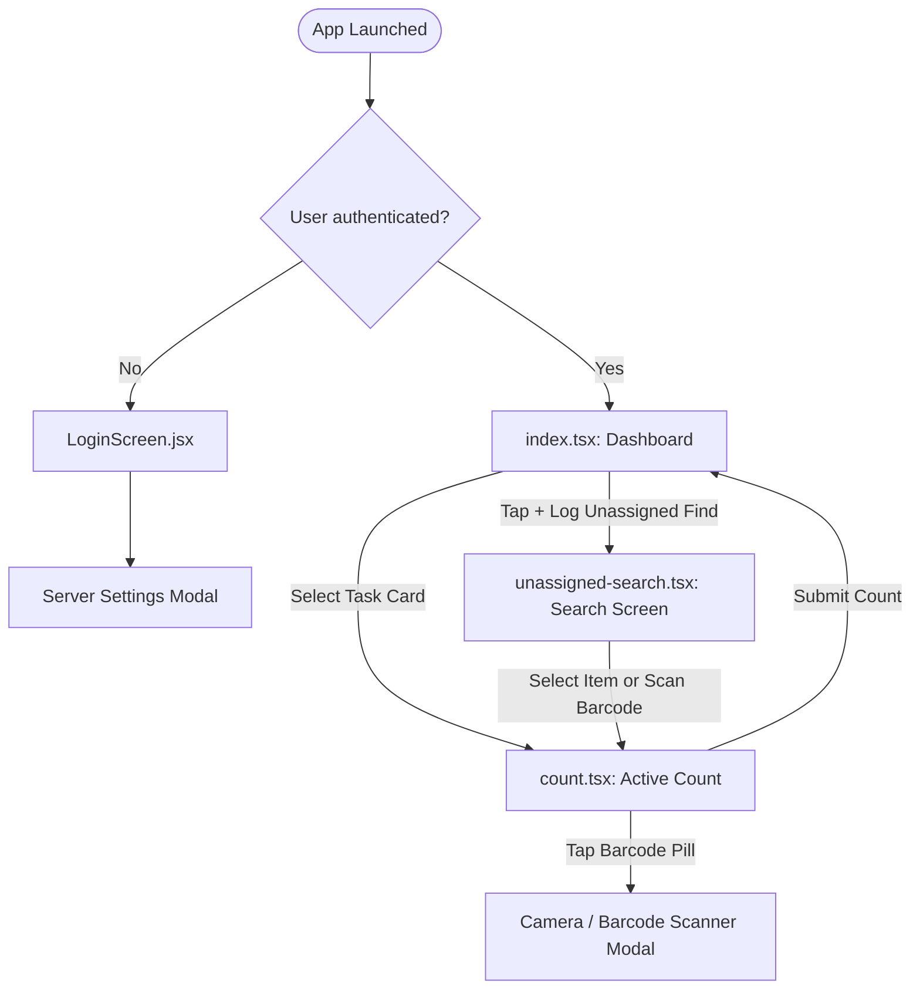

# Android App UI Reference Map

This document serves as a detailed UI/UX and architectural reference for the redesign of the React Native / Expo Mobile App. 

## 🗺️ Navigation & App Architecture

The app uses file-based routing with Expo Router, configured in [_layout.tsx](file:///home/dev-server/docker/forson-business-suite/packages/mobile/src/app/_layout.tsx).



---

## 📱 Page-by-Page Element Catalog

### 1. Login Screen
* **Source File**: [LoginScreen.jsx](file:///home/dev-server/docker/forson-business-suite/packages/mobile/src/screens/LoginScreen.jsx)
* **Layout**: Centered content card over a neutral background (`#f3f4f6`).

| UI Element | Component Type | Styles / Properties | Functionality |
| :--- | :--- | :--- | :--- |
| **Settings Gear Button** | `TouchableOpacity` | Top-right corner (floating, shadow, `#fff` background) | Opens Server Settings Modal |
| **Welcome Header** | `Text` | `fontSize: 28`, `fontWeight: 'bold'`, color `#1f2937` | Main title: "Welcome Back" |
| **Sub-Header** | `Text` | `fontSize: 16`, color `#6b7280` | Subtitle: "Sign in to continue" |
| **Username Input** | `TextInput` | Placeholder "Username", color `#1f2937`, border `#d1d5db` | Autofocus disabled, lowercase only |
| **Password Input** | `TextInput` | Placeholder "Password", `secureTextEntry`, border `#d1d5db` | Hides input text |
| **Log In Button** | `TouchableOpacity` | Background `#3b82f6`, `borderRadius: 8`, padding `16` | Triggers authentication request. Replaced with `ActivityIndicator` (spinner) when loading. |

#### ⚙️ Server Settings Modal (Nested in Login)
* **Overlay**: Semi-transparent dark background (`rgba(0,0,0,0.5)`).
* **Modal Card**: Max-width `400`, white background, card shadow.
* **Fields**:
  * **API Base Address Input**: `TextInput` with placeholder "e.g. 10.10.1.116:3001".
  * **Test Status Label**: `Text` displaying test success (Green `#10b981`) or failure (Red `#ef4444`).
  * **Buttons**:
    * **Test Connection**: Light-blue outlined button (`#eff6ff` / `#bfdbfe`). Invokes `/api/health`.
    * **Save**: Blue (`#3b82f6`) filled button. Commits server IP to persistent store (`useSettingsStore`).
    * **Close**: Plain gray label (`#9ca3af`) to dismiss modal.

---

### 2. Dashboard Screen
* **Source File**: [index.tsx](file:///home/dev-server/docker/forson-business-suite/packages/mobile/src/app/index.tsx)
* **Header Title**: "Dashboard" (native header title)

| UI Element | Component Type | Styles / Properties | Functionality |
| :--- | :--- | :--- | :--- |
| **Summary Row** | `View` | Flex Row, space-between layout | Container for high-level stats |
| **Total Items Card** | `View` | Gray shadow, white card. Value is Blue (`#3b82f6`, `fontSize: 24`, bold) | Displays total number of count tasks |
| **Pending Batches Card** | `View` | Same styling as Total Items Card | Displays count of unique, uncompleted batches |
| **List Title** | `Text` | `fontSize: 20`, bold, color `#1f2937` | Text: "Assigned Lines" |
| **Log Unassigned Button**| `TouchableOpacity` | Yellow pill button (`#f59e0b`), `borderRadius: 20` | Labels: "+ Log Unassigned Find". Navigates to `/unassigned-search`. |
| **Assigned Tasks List** | `FlatList` | Pull-to-refresh (`RefreshControl`) enabled | Renders list of assigned tasks |
| **Task Card Item** | `TouchableOpacity`| White background, light gray border (`#e5e7eb`), margin bottom `12` | Shows `display_name` (bold, `#1f2937`), `part_id`, and `batch_id`. Tapping starts task and opens `/count`. |

---

### 3. Active Count Screen
* **Source File**: [count.tsx](file:///home/dev-server/docker/forson-business-suite/packages/mobile/src/app/count.tsx)
* **Header Title**: "Active Count"

| UI Element | Component Type | Styles / Properties | Functionality |
| :--- | :--- | :--- | :--- |
| **Header Strip** | `View` | Light-gray background (`#f9fafb`), border-bottom `#e5e7eb` | Header container for quick navigation and actions |
| **Back Arrow** | `TouchableOpacity` | `Ionicons` (arrow-back, size `24`) | Returns to previous screen |
| **Barcode Status Pill** | `TouchableOpacity` | Green background (`#16a34a`) if has barcode, Gray (`#9ca3af`) if not | Displays "Barcode". Tapping opens Camera Scanner modal |
| **Item Title** | `Text` | `fontSize: 20` bold, center aligned, autoshrink enabled | Displays part display name / ID |
| **Item SKU/ID** | `Text` | `fontSize: 11`, opacity `0.7`, center | Displays internal SKU or ID |
| **Progress text** | `Text` | Gray (`#6b7280`), `fontSize: 12` | Displays "Item X of Y" or "⚠ Unassigned Find" (Yellow `#f59e0b`) |
| **Progress Bar Track** | `View` | Background `#e5e7eb`, height `4` | Progress indicator track |
| **Progress Bar Fill** | `View` | Blue background (`#3b82f6`), dynamic width | Fills according to completion progress |
| **Keypad Input Zone** | `View` | Occupies 78% of the height | Hosts the `<MobileCounter>` component |

#### 📸 Barcode Scanner Modal (Nested in Count)
* **Camera Interface**: `react-native-vision-camera` taking up full modal.
* **Scan Viewfinder**: Translucent dark overlay with center clear cutout (`borderWidth: 2`, border color `#3b82f6`).
* **Controls**:
  * **Close Button**: Circle icon (`close`, size `30`, white). Close modal.
  * **Torch Button**: Circle icon (`flash` / `flash-off`). Toggles flash.
* **Scan Bottom Sheet** (shows when barcode detected):
  * White sheet sliding from bottom with slide animation.
  * Displays scanned barcode value in large bold text (`#111827`).
  * Action buttons:
    * **Retake**: Outlined button (`#f3f4f6` / `#d1d5db`). Resumes camera.
    * **Accept**: Blue button (`#3b82f6`). Links barcode to the current item and closes modal.

---

### 4. Log Unassigned Find Screen
* **Source File**: [unassigned-search.tsx](file:///home/dev-server/docker/forson-business-suite/packages/mobile/src/app/unassigned-search.tsx)
* **Header Title**: "Log Unassigned Find"

| UI Element | Component Type | Styles / Properties | Functionality |
| :--- | :--- | :--- | :--- |
| **Header Bar** | `View` | White background, bottom border (`#e5e7eb`) | Title and back button header |
| **Search Row** | `View` | Flex Row, gap `10` | Wraps input field and barcode scan button |
| **Search Input Wrap** | `View` | White background, border `#e5e7eb`, height `48` | Container for search icon, input field, and clear button |
| **Search Icon / Spinner**| `ActivityIndicator` / `Ionicons` | Centered left icon | Shows spinner while searching, otherwise magnifying glass |
| **Search Input Field** | `TextInput` | Placeholder "Search by name, SKU, barcode…", `autoFocus: true` | Debounced text field (sends request `300ms` after typing stops) |
| **Clear Input Button** | `TouchableOpacity` | `Ionicons` (close-circle) | Clears query and search results |
| **Scanner Pill Button** | `TouchableOpacity` | Blue background (`#3b82f6`), width/height `48` | `Ionicons` (barcode-outline). Opens Camera Scanner Modal |
| **Interactive Hint** | `Text` | `fontSize: 11`, gray `#9ca3af` | Inline tutorial text |
| **Results List** | `FlatList` | Vertically scrolling list container | Shows autocomplete suggestions |
| **Result Card** | `TouchableOpacity`| Flex Row, white background, border `#e5e7eb`, shadow | Left icon (`cube-outline` in blue box), center info text, right chevron (`chevron-forward`). Tapping starts ad-hoc count. |

#### 📸 Barcode Scanner Modal (Nested in Unassigned Search)
* **Camera Interface**: Full screen camera view.
* **Scan Viewfinder**: Outlined cutout (`75%` width, blue border `#3b82f6`).
* **Controls**:
  * **Close Button**: Circle icon (`close`, size `28`, white).
  * **Instructions Overlay**: Label "Align barcode with frame" in white.
  * **Torch Button**: Circle icon (`flash` / `flash-off`).
* **Barcode Scan Logic**:
  * Scans barcode, immediately runs a lookup request, shows full-screen loading spinner overlay ("Looking up barcode...").
  * If found, automatically starts ad-hoc count (`startAdHocCount`) and routes to `/count`.
  * If NOT found, shows an Alert dialog option:
    1. *Cancel*: close search.
    2. *Assign to Existing*: instructions dialog on linking.
    3. *Create New Item*: instructions to use the Web Portal.

---

### 5. Reusable Component: Mobile Counter Keypad
* **Source File**: [MobileCounter.jsx](file:///home/dev-server/docker/forson-business-suite/packages/mobile/src/components/MobileCounter.jsx)
* **Layout**: Horizontal split (`60%` left column for keys, `40%` right column for display and actions).

```
┌─────────────────────────────────┬────────────────────────┐
│  [1]       [2]       [3]        │  ┌──────────────────┐  │
│                                 │  │ QTY              │  │
│  [4]       [5]       [6]        │  │ [ 120          ] │  │
│                                 │  └──────────────────┘  │
│  [7]       [8]       [9]        │  ┌────────┬─────────┐  │
│                                 │  │   -1   │   +1    │  │
│  [C]       [0]       [⌫]        │  └────────┴─────────┘  │
│  (Clear)             (Backspace)│  ┌──────────────────┐  │
│                                 │  │                  │  │
│                                 │  │      SUBMIT      │  │
│                                 │  │                  │  │
│                                 │  └──────────────────┘  │
└─────────────────────────────────┴────────────────────────┘
```

#### Keypad Elements (Left Column)
* **Key Buttons**: `TouchableOpacity` elements with gray background (`#f3f4f6`), border (`#e5e7eb`), and large text (`fontSize: 28`). Size calculated dynamically based on window width.
* **Clear Button (C)**: Highlighted with a light red background (`#fee2e2`) and red border (`#fca5a5`).
* **Backspace Button (⌫)**: Same light red highlight styling as the Clear button.

#### Display & Control Panel (Right Column)
* **Border Divider**: Vertical border (`#e5e7eb`) separating the columns.
* **Quantity Display**: Box with light gray background (`#f3f4f6`), label "Qty" in uppercase gray text (`#6b7280`), and current quantity in huge bold text (`fontSize: 42`).
* **Quick Actions Row**: Two equal-width buttons:
  * **−1 Button**: Gray box (`#f3f4f6`) that decrements quantity by 1 (clamped to a minimum of 0).
  * **+1 Button**: Gray box that increments quantity by 1.
* **Submit Button**: Large blue button (`#3b82f6`), taking up the rest of the column's height. Triggers submit callback on click.

---

## 🎨 Global Styling & Asset Resources

* **Background Colors**:
  * Primary background: `#f3f4f6` (light gray)
  * Secondary / card background: `#ffffff`
  * Status overlay: `rgba(0, 0, 0, 0.5)` to `rgba(0, 0, 0, 0.65)`
* **Primary Branding Color**:
  * Blue: `#3b82f6` (used for primary actions, progress bars, active selections)
* **Accent Colors**:
  * Orange/Yellow: `#f59e0b` (used for ad-hoc / unassigned items)
  * Green: `#16a34a` / `#10b981` (successful status / barcode linked)
  * Red: `#ef4444` / `#dc2626` (errors, backspaces, and cancellations)
* **Typography**:
  * Text Colors: `#111827` (dark primary), `#1f2937` (dark secondary), `#6b7280` (gray secondary), `#9ca3af` (muted placeholder)
* **Icon Packs**:
  * Native iOS/Android: `Ionicons` (from `@expo/vector-icons`) and `SymbolView` (from `expo-symbols`)
* **Haptic Feedback**:
  * `expo-haptics` triggers success vibrations on successful barcode scans.
